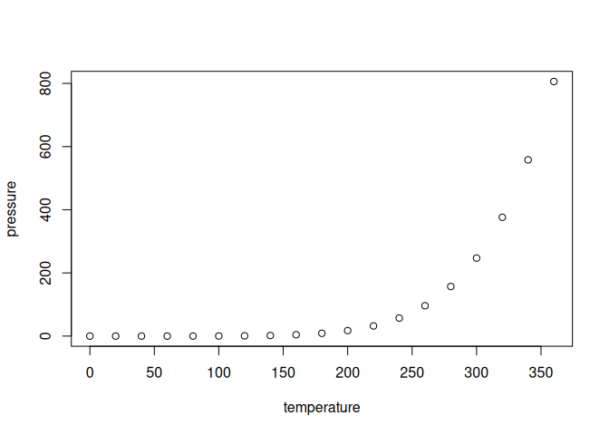

<!-- README.md is generated from README.Rmd. Please edit that file -->

# jmisc

<!-- badges: start -->

<!-- badges: end -->

The goal of jmisc is to contain all my miscellaneous R utility
functions.

## Installation

You can install the development version of jmisc from
[GitHub](https://github.com/) with:

``` r
# install.packages("pak")
pak::pak("jttoivon/jmisc")
```

## Example

This is a basic example which shows you how to solve a common problem:

``` r
library(jmisc)
## basic example code
```

What is special about using `README.Rmd` instead of just `README.md`?
You can include R chunks like so:

``` r
is_whole_number(c(0.0, 1, NA))
#> [1] TRUE
```

You’ll still need to render `README.Rmd` regularly, to keep `README.md`
up-to-date. `devtools::build_readme()` is handy for this.

You can also embed plots, for example:



In that case, don’t forget to commit and push the resulting figure
files, so they display on GitHub and CRAN.
